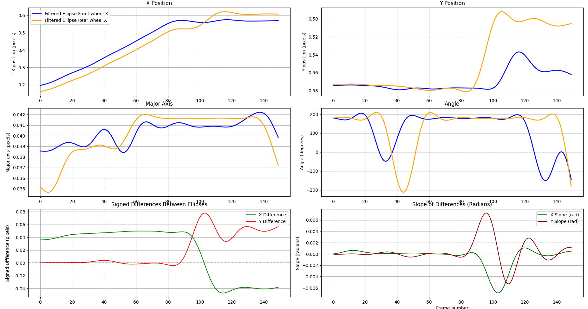

Bicycle crash analysis using instance segmentation
==================================================

Introduction
------------

Bicycle usage carries several benefits, from less traffic congestion in cities,
less polution, healthier lifestyle, among others. However, cyclist are
vulnerable road users, which crash rate is in increase <cite>[Eco24][1]</cite>.
For this reason, research in the field of bicycle crashes during the 15 last
years have gained popularity. Within the types of bicycle crashes, one that
stands out is the single-cyclist crash, where no other road user is involved.

The lack of data of these events is commonly discussed in the literature
<cite>[Utr20][2]</cite>. However, no solutions have been provided,
and recreating crashes lead to dangerous situations for test subjects even in
laboratory controlled setups. For this reason, we propose a solution based on
publicly available videos of single-cyclist crashes.

To this end, we create a dataset of single-cyclist crashes from web sources.
Videos are annotated for computer vision tasks, and used to create motion data.
With this, we analyse the motion of the wheels and identify crash events.

Methods
-------

For this research we have manually selected videos from public domain sources.
Selected videos contain bicycle crashes where no other road user is involved, or
their participation in the event is assumed as a passive perturbation. A
dataset of single-cyclist crashes is created from these videos, which include
the reference to the video and the time stamp of the crash.

The dataset was annotated using CVAT for instance segmentation in YOLO format.
Using this approach, we label the wheels as ellipses using 'front' and 'rear'
as features. In addition, we annotate no-crash videos of similar nature to
include into the dataset to contrast normal riding motion against crash motion.

Results
-------

The data obtained is the $x$ and $y$ position of both wheels, along with the ratio
between axes and the angle of the ellipse. In addition, we calculate the
distance between both wheels in time and the slope of the curve.

Figure \ref{Crash1} shows the data of a 'pitch-over' crash. Pitch-over is a
crash motion where, due to excessive longitudinal load transfer, the rear wheel
lifts from the ground and the bicycle rotates around the contact point of the
front wheel.

We observe that after frame 100, the rear wheel moves forward to the front
wheel. In line manner, between frame 85 and 105, there is a major increase in
the vertical position of the rear wheel. Furthermore, the peak difference
between the wheels is equivalent to a 282% with respect to the average
difference.

It is important to note that the origin of the reference frame is on the top 
left corner, however, to simplify the analysis, the $y$ axis was inverted for a
more intuitive reading.

Following the same methodology, we extract data from more videos of the dataset.
The main findings are summarised in the table below.

Table: Distance between wheels from crash videos. \label{crashTable}

| Number | Type         | Avg x diff. | Avg y diff.| Max x % | Max y % |
|--------|--------------|-------------|------------|---------|---------|
|    1   |Pitch-over    | -0.08       | 0.08       | -93.2   | 178.5   |
|    3   |Start riding  | -0.07       | 0.01       | -10.3   | 226.1   |
|    5   |Pitch-over    | 0.02        | 0.02       | 167.7   | 282.7   |
|    6   |Pitch-over    | -0.1        | 0.03       | -93.7   | 577.7   |
|    7   |Pitch-over    | 0           | 0.01       | -844    | 1203.2  |
|    8   |Lost control  | 0.01        | 0.06       | 1142    | 196     |
|    9   |Pitch-over    | -0.09       | 0.04       | -84     | 141.6   |
|   10   |Disengagement | -0.04       | -0.01      | -57.7   | -309.9  |
|   11   |Pitch-over    | 0.01        | 0.01       | 412.9   | 1286.6  |

For all crash scenarios, the maximum $y$ difference with respect to the average
surpases 100%. 

Table: Data of no-crash videos. \label{nocrashTable}

| Number | Avg x diff. | Avg y diff. | Max x % | Max y % |
|--------|-------------|-------------|---------|---------|
|    1   | 0           | -0.01       | 559.4   | -88.5   |
|    3   | -0.3        | 0           | -15.4   | 1832.4  |
|    4   | -0.38       | 0           | -79.5   | -1078.6 |

Discussion
----------

Preliminary results shown in this work are promising, offering a new approach
for already identified problems in the field of bicycle safety. Problems
addressed in this research are bicycle crash detection and the lack of
single-cyclist real-world crash data. Additionally, this represents the first
dataset composed only of single-cyclist crashes.

Initially, we have been able to distinguish crash and no-crash scenarios from
2-dimensional wheel positions. We observe that crash scenarios present higher
average variations in the motion of the wheels. Furthermore, pitch-over crash
configurations always show variations over 150% with respect to the average
difference. In line manner, the average difference for both directions (x and y)
is greater than 0.01 pixels. Contrarily, no-crash scenarios tend to show average
differences below 0.01 pixels for one of the directions.

### Limitations

This work faces several limitations that are not fully covered in the
preliminary results.

First, the full dataset now comprises 100 videos of single-cyclist crashes,
however, we have used only 9 of these for analysis. Similarly, for no-crash
events, we have used only three samples.

Second, the videos that more information provide are side-view videos, which
offer a clear image of the wheel as an ellipse. On the other hand,
longitudinally-recorded videos present the challenge of annotate an ellipse in a
shape that is not one.

Third, this approach neglects the rotation of the wheels, which leads to not
detecting the longitudinal slip of the wheels.

Fourth, since our dataset is made mainly from dashcam videos, we assume a frame
rate of 30 FPS, which is not ideal for crash analysis.

At last, the motion of the camera could lead to outliers where no-crash videos
generate data with variations similar to crash videos (see Table \ref{crashTable}).

To summarise, the presented methodology allows to gather data from real-world
scenarios. Results show that the obtained data is useful for analysis and could
be enhanced if challenges are tackled up. Integrating different techniques into
the pipeline used in this work, several of the mentioned challenges can be
solved. This research will continue in development to enhance results.

Conclusion
----------

In this work, a dataset of single-cyclist crash videos have been created. Using
computer vision techniques on these videos, we extract 2-dimensional motion data
of the wheels. Then, we analyse the motion of the wheels in different crash
scenarios. We conclude that crash configurations where large vertical motions
occur are easier to identify. Further work will be to assess near-miss
situations and apply triangulation techniques to generate 3-dimensional data.

References
----------

[1]: European Commission (2024) Facts and Figures Cyclists. European Road Safety
Observatory. Brussels, European Commission, Directorate General for Transport.

[2]: Utrianen, R. (2020) Characteristics of Commuters’ Single-Bicycle Crashes in Insurance Data.
