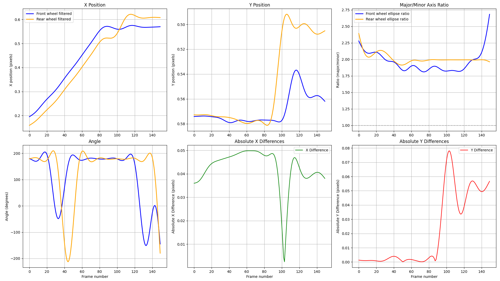

Bicycle crash motion using instance segmentation
================================================

Introduction
------------

Bicycle usage carries several benefits, from less traffic congestion in cities,
less pollution, a healthier lifestyle, among others. However, cyclists are
vulnerable road users, and crash rates are increasing <cite>
[European Commission 2024][1]</cite>. For this reason, research in the field of
bicycle crashes during the last 15 years has gained popularity. Within the types
of bicycle crashes, one that stands out is the single-cyclist crash, where no
other road user is involved, and its share ranges from 50 to 85% of
bicycle-related hospital admissions <cite>[Utriainen et al. 2023][3]</cite>.

For instance, a common crash configuration is known as 'pitch-over'. This occur
when, due to excessive longitudinal load transfer, the rear wheel lifts from the
ground and the bicycle rotates around the contact point of the front wheel.
<cite>[Gildea et al. 2021][7]</cite>.

The lack of data on these events is commonly discussed in the literature
<cite>[Utriainen 2020][2]</cite>. However, no solutions have been provided,
and recreating crashes leads to dangerous situations for test subjects even in
laboratory-controlled setups. For this reason, we propose a solution to gather
single-cyclist crash data based on monocular video analysis. In order to
automate this analysis, we delve into computer vision techniques. Among the
common computer vision tasks, we find object detection, semantic segmentation
and instance segmentation. Object detection consists of identifying an object of
a certain class in a digital image <cite>[Zou et al. 2023][6]</cite>. Semantic
segmentation deals with demarcating different objects and parts of an unknown
image <cite>[Guo et al. 2018][5]</cite>. Then, instance segmentation is the task
that combines both previously mentioned goals simultaneously, identifying the
class of the object and segmenting it in the image
<cite>[Hafiz, A.M., Bhat, G.M. 2020][4]</cite>. 

Although in the literature we find bicycle crash analysis using computer vision
methods <cite>[Gildea et al. 2024][8]</cite>, the focus was on the rider fall
outcome and not on the bicycle's particular dynamics. Therefore, the aim of this
study is to gather bicycle crash motion data from monocular videos. To this end,
we created a dataset of single-cyclist crashes from web sources. From these
videos, we track the motion of the bicycle by identifying and tracking the
position of the wheels.

Methods
-------

To create a database of single-cyclist crash videos, we manually selected videos
from public domain sources, such as YouTube. Selected videos contain bicycle
crashes where no other road user is involved, or if there is another user, its
participation in the event is assumed as a passive perturbation, i.e. the
exerted force is uncontrolled and it does not depend on the source. The dataset
consists of 100 videos with an average duration of three seconds and their time
stamp on the original source.

The dataset was annotated for instance segmentation with ellipse shapes for
wheels, labelling them with 'front' and 'rear' as features. These annotations
give the boundary points of the ellipses, from which we obtain the position of
wheel centres (in pixels) and their orientation by estimating the rotation angle
with respect to the vertical axis. In addition, we calculate the ratio between
the minor and major axes of the ellipses, from which it is possible to estimate
the view angle. At last, we calculate the x and y distances in pixels between the
centres of both ellipses.

Results
-------

[//]: # (If matplotlib use "layout='constrained")

In Figure \ref{Annotation}, three annotated video frames are shown along with
the reference frame and a schematic representation of the crash motion.

Figure \ref{Crash1} shows the data from the presented crash frames. In the top
row, we show the x and y positions of the wheels' centres with respect to the
frame numbers, along with the ratio between the major and the minor axes of the
ellipses. In the bottom left corner, we plot the angle with respect to the
vertical axis of the ellipses. Then, we plot the distance between wheel centres
in both axes.

We observe that after frame 100, the rear wheel moves forward over the front
wheel. Similarly, between frames 85 and 105, there is a major increase in the
vertical position of the rear wheel. Taking into account the average distance in
the $y$ axis between both wheel centres, a peak is observed during the crash 
motion, which is equivalent to 283% of the average distance.

Discussion
----------

Problems addressed in this research are the lack of real-world single-cyclist
crash data and its analysis using computer vision techniques. Using instance
segmentation, we were able to track the position of the wheels of the bicycle in
the image and analyse its crash motion.

From preliminary results, we observe that sudden variations in the distance
between wheel centres allows to identify crashes with large vertical rotations
of the bicycle, such as pitch-over crashes.

Some limitations of this approach are that the dataset is made mainly of dashcam
videos, which means the camera can be moving, and we have to assume a frame rate
of 30 FPS. Additionally, this methodology neglects the rotation of the wheels,
leading to not detecting longitudinal slip if it exists.

To summarise, the presented methodology allows to gathering useful data from
real-world scenarios for its analysis. By integrating different techniques into
the pipeline used in this work, results can be enhanced, taking into account the 
mentioned limitations. This work continues in development to apply regression
methods to the gathered data.

Conclusion
----------

In this work, we have created a video dataset of single-cyclist crashes. Using
computer vision techniques on these videos, we extracted 2-dimensional motion
data of the wheels in different crash scenarios. We conclude that crash
configurations where large vertical motions occur are easier to identify.
Additionally, side-view videos provide better information for the present
approach. Further work will be to assess near-miss situations to compare and
apply machine learning algorithms to the data to cluster the type of crashes.

References
----------

[1]: European Commission (2024) Facts and Figures Cyclists. European Road Safety Observatory. Brussels, European Commission, Directorate General for Transport.

[2]: Utriainen, R. (2020). Characteristics of Commuters’ Single-Bicycle Crashes in Insurance Data. Safety, 6(1), 13. https://doi.org/10.3390/safety6010013

[3]: Roni Utriainen, Steve O’Hern & Markus Pöllänen (2023) Review on single-bicycle crashes in the recent scientific literature, Transport Reviews, 43:2, 159-177, DOI: 10.1080/01441647.2022.2055674

[4]: Hafiz, A.M., Bhat, G.M. A survey on instance segmentation: state of the art. Int J Multimed Info Retr 9, 171–189 (2020). https://doi.org/10.1007/s13735-020-00195-x

[5]: Guo, Y., Liu, Y., Georgiou, T. et al. A review of semantic segmentation using deep neural networks. Int J Multimed Info Retr 7, 87–93 (2018). https://doi-org.tudelft.idm.oclc.org/10.1007/s13735-017-0141-z

[6]: Z. Zou, K. Chen, Z. Shi, Y. Guo and J. Ye, "Object Detection in 20 Years: A Survey," in Proceedings of the IEEE, vol. 111, no. 3, pp. 257-276, March 2023, doi: 10.1109/JPROC.2023.3238524

[7]: Gildea, K., Hall, D., & Simms, C. (2021). Configurations of underreported cyclist-motorised vehicle and single cyclist collisions: Analysis of a self-reported survey. Accident Analysis &Amp; Prevention, 159, 106264. https://doi.org/10.1016/j.aap.2021.106264

[8]: Gildea, K., Hall, D., Cherry, C. R., & Simms, C. (2024). Forward dynamics computational modelling of a cyclist fall with the inclusion of protective response using deep learning-based human pose estimation. Journal of Biomechanics, 163, 111959. https://doi.org/10.1016/j.jbiomech.2024.111959
